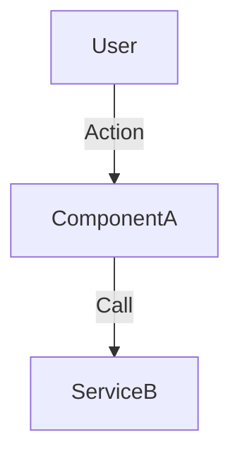

# Design: documentation

## アーキテクチャ概要
この機能の技術的な実現方針を記述します。

## コンポーネント設計
### Mermaid Diagram

```mermaid
graph TD
    User -->|Action| ComponentA
    ComponentA -->|Call| ServiceB
```

## Component Structure
- UIコンポーネントの構成と階層構造

## データ構造
- 主要なインターフェースや型定義

## 依存関係
- 外部APIやライブラリへの依存
